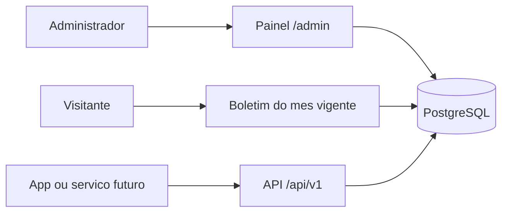

# Planejamento do produto ICVB

Diretrizes de início do projeto. Este arquivo é a referência de arquitetura, stack, dados, Docker, painel administrativo, auditoria e fases. A implementação Laravel começa **depois** da aprovação deste documento.

**Primeiro cliente:** Igreja Congregacional Vale da Benção (ICVB).
**Tela de origem:** o dashboard público atual em `index.html` + `css/styles.css` deve ser preservado ao migrar para Blade.

---

## 1. Visão

O projeto nasce como **boletim mensal da ICVB** e deve evoluir para um **produto de gestão para igrejas**, configurável, com o mesmo banco servindo o site, o painel e, no futuro, aplicativo mobile ou outros serviços.

| Horizonte | O que entrega |
| --- | --- |
| Agora | Página pública do boletim do **mês vigente** + painel para cadastrar e publicar o mês seguinte, com histórico dos meses anteriores |
| Depois | O painel vira gestão da igreja (membros, escalas contínuas, finanças, etc.) |
| Médio prazo | Produto multi-igreja, white-label e configurável |

**Regra do mês vigente:** timezone `America/Fortaleza`. Em 1º de setembro, o público passa a ver setembro; agosto permanece no histórico e no painel. Administradores podem preparar o boletim de setembro em agosto sem alterar a home.

Princípios:

- Tudo gratuito (MIT/Apache/BSD ou equivalente). Nada pago.
- Inserção consistente, com constraints no banco e validação na aplicação.
- Auditoria completa de criações, alterações, exclusões e publicações.
- Um único PostgreSQL para web, admin e API.
- Docker desde o primeiro commit da Fase 0, para qualquer dev subir o mesmo ambiente.

---

## 2. Arquitetura alvo



- **Público (`/`):** boletim publicado do ano/mês atuais em `America/Fortaleza`. Visual igual ao dashboard atual.
- **Admin (`/admin`):** Filament. CRUD do boletim, publicação, histórico, usuários, auditoria.
- **API (`/api/v1`):** JSON a partir do mesmo Postgres, pronta para app ou serviço.
- **Uma igreja no banco no início**, com `church_id` em todas as entidades de negócio para não refazer o modelo quando o produto for multi-igreja.

---

## 3. Stack (somente software livre)

| Camada | Escolha | Motivo |
| --- | --- | --- |
| Linguagem | PHP 8.4 | Estável, compatível com Laravel 13 (exige PHP 8.3+) |
| Framework | Laravel 13 | Versão mais recente com suporte ativo (bugfix até ~Q3 2027, segurança até mar/2028) |
| Banco | PostgreSQL 17 | Gratuito, JSONB, FKs fortes, adequado a web + API; volume Docker previsível. PostgreSQL 18 mudou o `PGDATA` na imagem oficial e gera atrito desnecessário no início |
| Cache e fila | Redis | Padrão Laravel, gratuito |
| Painel admin | Filament 5 | MIT, painel profissional rápido, escala até o ERP da igreja |
| Auth da API | Laravel Sanctum | Tokens para mobile/serviço, sem custo |
| Auditoria | `spatie/laravel-activitylog` | Quem alterou o quê, quando, com dirty attributes |
| Permissões | `spatie/laravel-permission` | Papéis `admin` e `editor` no início |
| Front público | Blade + CSS atual (`css/styles.css`) | Sem rebuild visual na Fase 1 |
| Runtime | Docker Compose | Mesmo ambiente para todos os devs |
| E-mail local | Mailpit | Só em desenvolvimento, gratuito |

**Proibido no projeto:** Laravel Nova, Firebase pago, e-mail/host/SaaS com cartão, qualquer dependência que exija licença comercial.

---

## 4. Modelo de dados (fase boletim)

### 4.1 Tabelas

**`churches`**

- `id`, `name`, `slug` (unique), `timezone` (default `America/Fortaleza`), `pix_key`, `settings` (JSONB), timestamps, soft delete.
- Seed inicial: ICVB, PIX `50.208.029/0001-31`.

**`users`**

- Usuários Laravel padrão + papéis Spatie.
- Papéis iniciais: `admin` (tudo) e `editor` (boletins, sem gerir usuários).

**`bulletins`**

- `church_id` (FK), `year` (int), `month` (1–12), `theme` (nullable), `status` (`draft` \| `published`), `published_at` (nullable), timestamps, soft delete.
- Unique: `(church_id, year, month)`.
- Um boletim por igreja por mês.

**Filhos do boletim** (todos com `bulletin_id`, `sort_order` quando fizer sentido, timestamps e soft delete):

| Tabela | Conteúdo |
| --- | --- |
| `schedule_items` | Programação semanal: `day_label`, `description`, `is_highlight` |
| `special_events` | Eventos: `event_date`, `weekday_label`, `title`, `subtitle` |
| `service_rosters` | Escala de servir: `service_date`, `introducers`, `offertory`, `leaders`, `preachers`, `support` |
| `children_ministry_rosters` | Culto infantil: `service_date`, `nursery`, `primary_class` |
| `ebd_classes` | Professores EBD: `class_name`, `teachers_text` |
| `birthdays` | Aniversariantes: `day` (1–31), `name` |

Os KPIs da home (8, 4, 5, 10) são **calculados** a partir dessas coleções, não persistidos.

### 4.2 Regras de leitura

- Timezone da aplicação: `America/Fortaleza` (`APP_TIMEZONE` e `church.timezone`).
- Home pública: boletim `published` com `year`/`month` iguais ao agora em Fortaleza.
- Se o mês vigente ainda não tiver boletim publicado: estado vazio amigável (não cair no mês anterior).
- Histórico: meses anteriores permanecem no banco e no painel; a API pode expor mês específico para o app no futuro.
- Admin pode ter vários rascunhos; só `published` aparece no público.

### 4.3 Qualidade dos dados

- Foreign keys, unique `(church_id, year, month)`, checks de `month` 1–12 e `day` 1–31.
- Validação no Filament e Form Requests na API.
- Soft delete em entidades de negócio.
- Seed obrigatório do boletim de **agosto/2026** (conteúdo atual do `index.html`), já publicado, para a home nascer preenchida.

---

## 5. Painel administrativo

URL: `/admin` (Filament 5).

Ações da Fase 2:

- Login (e-mail/senha). Comando para criar o primeiro usuário: `php artisan make:filament-user` (documentar no README operacional).
- CRUD de boletins, com filhos em Repeaters (programação, eventos, escalas, infantil, EBD, aniversariantes).
- Ação **Publicar** / **Despublicar** (muda `status` e `published_at`).
- Listagem por ano/mês, filtro por status, busca por tema.
- Gestão de usuários e papéis (`admin` apenas).
- Recurso de **auditoria** (somente leitura): usuário, ação, model, dirty attributes, IP, data.
- Igreja: edição do cadastro da ICVB (nome, PIX, timezone) pelo `admin`.

Fluxo típico de setembro, ainda em agosto:

1. Editor cria boletim `2026-09` como `draft`.
2. Preenche programação, eventos, escalas, aniversariantes.
3. Revisa e publica.
4. Em 01/09 (Fortaleza), a home passa a exibir setembro sozinha. Agosto continua no histórico.

---

## 6. Auditoria

Toda mutação de negócio deve gerar activity log:

- create, update, delete (soft), publish, unpublish.
- Registrar: `causer` (usuário), model, `event`, atributos antigos/novos, IP, user-agent, timestamp.
- Consulta no painel; sem edição/exclusão de logs pela UI.
- Não logar senhas nem tokens.

---

## 7. API pública (desde a Fase 3; contrato já definido)

Mesmo Postgres. JSON versionado. Sanctum entra quando houver cliente autenticado; os GETs de boletim publicado podem ser públicos.

| Método | Rota | Uso |
| --- | --- | --- |
| `GET` | `/api/v1/bulletins/current` | Mês vigente em `America/Fortaleza` |
| `GET` | `/api/v1/bulletins/{year}/{month}` | Mês específico publicado (histórico / app) |

Resposta inclui igreja (nome, PIX), tema, programação, eventos, escalas, infantil, EBD, aniversariantes e KPIs derivados.

---

## 8. Docker

O projeto **nasce** na Fase 0 já dockerizado. Nenhum dev precisa ter PHP/Postgres/Redis na máquina, só Docker.

### 8.1 Serviços de desenvolvimento

| Serviço | Imagem / papel |
| --- | --- |
| `app` | PHP 8.4-FPM (Composer, extensões `pgsql`, `redis`, `mbstring`, `gd`, `intl`) |
| `nginx` | HTTP na porta `8000` (ou `80` mapeada) |
| `postgres` | `postgres:17` |
| `redis` | cache, sessão, fila |
| `mailpit` | e-mail de dev (UI em porta dedicada) |
| `queue` | `php artisan queue:work` (mesmo image do `app`) |
| `scheduler` | `php artisan schedule:work` (mesmo image do `app`) |

Volumes: código montado no `app`, volume nomeado para dados do Postgres e do Redis.

### 8.2 Bootstrap esperado (README operacional, Fase 0)

```bash
cp .env.example .env
docker compose up -d --build
docker compose exec app composer install
docker compose exec app php artisan key:generate
docker compose exec app php artisan migrate --seed
```

Acessos locais previstos:

- Site: `http://localhost:8000`
- Admin: `http://localhost:8000/admin`
- Mailpit: `http://localhost:8025`

### 8.3 Produção (documentar, não implementar agora)

- Mesmas imagens, sem Mailpit.
- `APP_DEBUG=false`, `APP_ENV=production`, secrets fora do Git.
- HTTPS (proxy reverso ou plataforma).
- Worker e scheduler sempre ligados.
- Backup: `pg_dump` periódico do PostgreSQL 17.
- Healthcheck HTTP + Postgres.
- Filas e cache no Redis.
- Deploy sugerido (gratuito/self-hosted): VPS + Docker Compose, ou equivalente. Sem amarrar a serviço pago.

---

## 9. Front público

- Migrar `index.html` para Blade na Fase 1, reaproveitando `css/styles.css` (e o JS do PIX).
- Dados vêm do boletim publicado do mês vigente.
- KPIs calculados no backend ou na view a partir das coleções.
- Manter hover dos cards, navegação âncora e botão de copiar PIX (PIX vem de `churches.pix_key`).

---

## 10. Fases

### Esta etapa (concluída por este arquivo)

- `docs/PLANEJAMENTO.md` — diretrizes de início.

### Fase 0 — Esqueleto

- Laravel 13 + PHP 8.4 + Docker Compose (app, nginx, postgres:17, redis, mailpit, queue, scheduler).
- `.env.example`, timezone `America/Fortaleza`.
- README operacional: como subir, URLs, primeiro usuário.
- Healthcheck básico.

### Fase 1 — Domínio do boletim + home

- Migrations e models da seção 4.
- Seed da igreja ICVB + boletim agosto/2026 publicado.
- Home pública dinâmica (Blade + CSS atual).
- Testes de “mês vigente” com timezone Fortaleza (incluindo virada de mês).

### Fase 2 — Painel

- Filament 5 em `/admin`.
- CRUD completo do boletim e filhos.
- Publicar / despublicar.
- Papéis `admin` e `editor`.
- Auditoria visível no painel.

### Fase 3 — API e notas de produção

- `GET /api/v1/bulletins/current` e `GET /api/v1/bulletins/{year}/{month}`.
- Sanctum instalado (pronto para o app).
- Documentar produção no README (HTTPS, backup, workers, secrets).

### Depois (produto de gestão)

- Membros, congregações, escalas contínuas, finanças, comunicação.
- Multi-igreja de verdade (tenancy por `church_id` / domínio / slug).
- Configuração por igreja via `settings` JSONB e telas Filament.
- App mobile consumindo a API.

---

## 11. Fora de escopo agora

- Multi-tenant completo (subdomínios, billing, isolation avançada).
- Aplicativo mobile.
- Pagamentos, e-mail marketing, WhatsApp Business pago.
- Reescrever o layout público (só ligar aos dados).
- PostgreSQL 18 (avaliar depois, com volume `PGDATA` correto).
- Deploy automatizado em nuvem paga.

---

## 12. Critérios de pronto da primeira entrega útil (Fases 0–2)

- `docker compose up` sobe o sistema em máquina limpa com Docker.
- `/` mostra o boletim de agosto/2026 enquanto a data em Fortaleza for agosto/2026.
- Em setembro, `/` não mostra agosto; mostra setembro se publicado, senão estado vazio.
- `/admin` permite criar o boletim do mês seguinte, publicar, e consultar o histórico.
- Toda alteração de boletim aparece na auditoria com usuário e campos alterados.
- Nenhuma dependência paga.

---

## 13. Próximo passo

Com este documento aprovado, a implementação começa pela **Fase 0**: esqueleto Laravel 13 + Docker + PostgreSQL 17 + Redis, e README de bootstrap para outros devs.
